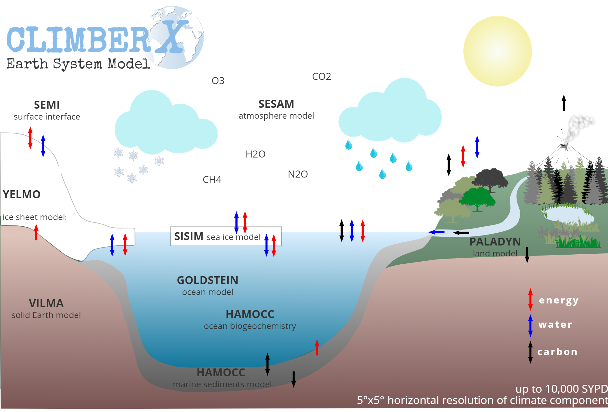

Welcome to **CLIMBER-X**, a fast Earth system model.

**CLIMBER-X** simulates the response of the Earth system to changes in different climate forcings, 
such as changes in greenhouse gas concentrations or in the Earth's orbital configuration. To do so the model
represents the physical processes in atmosphere, ocean and on land that determine the climate state of the Earth.
It also simulates the bio- and geochemical processes in the biosphere, soil, ocean and marine sediments and therefore allows for an interactive determination of the atmospheric CO2 and methane concentrations.
**CLIMBER-X** also includes two different models for the continental ice sheets and a model for the response of the solid Earth to changes in surface load. Specifically, the model includes the following components:

- SESAM: semi-empirical statistical-dynamical atmosphere model
- GOLDSTEIN: 3-D frictional-geostrophic ocean model
- HAMOCC: ocean and sediments carbon cycle model
- SISIM: sea ice model
- PALADYN: land model
- Yelmo or SICOPOLIS: ice sheet models
- VILMA: viscoelastic lithosphere and mantle model

The general **CLIMBER-X** design and the details of the climate model component are described in the following article:
> Willeit, M., Ganopolski, A., Robinson, A., and Edwards, N. R.: The Earth system model CLIMBER-X v1.0 – Part 1: Climate model description and validation, Geosci. Model Dev., 15, 5905–5948, [https://doi.org/10.5194/gmd-15-5905-2022](https://doi.org/10.5194/gmd-15-5905-2022), 2022.

The global carbon cycle model of **CLIMBER-X** is described in:
> Willeit, M., Ilyina, T., Liu, B., Heinze, C., Perrette, M., Heinemann, M., Dalmonech, D., Brovkin, V., Munhoven, G., Börker, J., Hartmann, J., Romero-Mujalli, G., and Ganopolski, A.: The Earth system model CLIMBER-X v1.0 – Part 2: The global carbon cycle, Geosci. Model Dev., 16, 3501–3534, [https://doi.  org/10.5194/gmd-16-3501-2023](https://doi.org/10.5194/gmd-16-3501-2023), 2023.

The ice sheet model coupling and the ice sheet surface mass balance scheme are described in:
> Willeit, M., Calov, R., Talento, S., Greve, R., Bernales, J., Klemann, V., Bagge, M., and Ganopolski, A.: Glacial inception through rapid ice area increase driven by albedo and vegetation feedbacks, Clim. Past, 20, 597–623, [https://doi.org/10.5194/cp-20-597-2024](https://doi.org/10.5194/cp-20-597-2024), 2024.

The **CLIMBER-X** code repository can be found here:
[https://github.com/cxesmc/climber-x](https://github.com/cxesmc/climber-x)

See [Getting started](getting-started.md) to see how to get the code,
compile a test program and run simulations.
